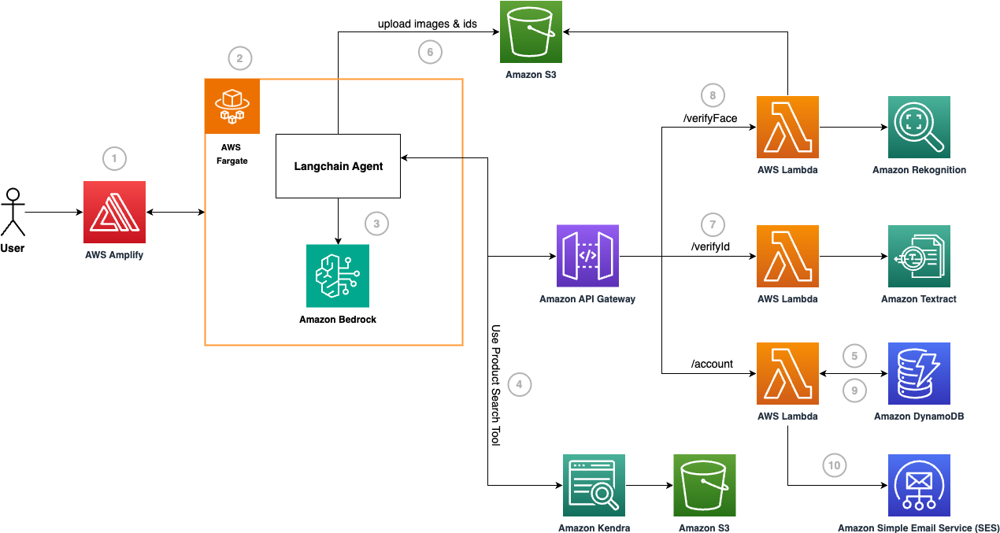

## Automate user on-boarding for financial services with Generative AI powered Digital Assistant

In this repository, we present a solution that harnesses the power of Generative AI to streamline the user onboarding process for financial services through a digital assistant. Onboarding new customers in the banking is a crucial step in the customer journey, involving a series of activities designed to fulfill Know-Your-Customer (KYC) requirements, conduct necessary verifications, and introduce them to the bank's products or services. Traditionally, user onboarding has been a tedious and heavily manual process. Our solution provides practical guidance on addressing this challenge by leveraging a Generative AI assistant on AWS. 

Amazon Bedrock is a fully managed service that offers a choice of high-performing foundation models (FMs) from leading AI companies like AI21 Labs, Anthropic, Cohere, Meta, Mistral AI, Stability AI, and Amazon via a single API, along with a broad set of capabilities you need to build generative AI applications with security, privacy, and responsible AI. Using Anthropic Claude 3 Haiku on Amazon Bedrock, we build a digital assistant that automates paperwork, identity verifications, and engages customers through conversational interactions, called Amazon Penny. As a result, customers can be onboarded in a matter of minutes through secure, automated workflows. 

## Architecture




The flow of the application is as follows:

1. Users access the front-end website hosted within the AWS Amplify. 

2. The website invokes an endpoint to interact with the digital assistant, Penny, which is containerized and deployed in AWS Fargate. 

3. The digital assistant uses a custom Langchain Agent to answer questions on the bank's products and services and orchestrate the onboarding flow. The Large Language Model (LLM) used by the agent is Anthropic Claude 3 Haiku, provided by Amazon Bedrock. 

4. If the user asks a general question related to the bank's products or services, the agent will utilize a custom Langchain Tool called the Product Search Tool. This tool uses Amazon Kendra linked with an S3 data source which contains the bank's data. 

5. If the user indicates that they would like to open a new account, the agent will prompt the user for their email. Once the user responds, it will utilize a custom Langchain Tool called the Email Validation Tool. This tool checks if there is an existing account in the bank's Amazon DynamoDB database, by calling an endpoint deployed in Amazon API Gateway.

6. After the email validation, KYC information is gathered such as first and last name. Then, the user is prompted for an identity document. This is uploaded to Amazon S3.

7. The agent will utilize a custom Langchain Tool called the ID Verification Tool. This tool checks if the user details entered during the session match the ID, by calling an endpoint deployed in Amazon API Gateway. The details are verified by extracting the document text using Amazon Textract.

8. After the ID verification, the user is asked for a selfie. The image is uploaded to Amazon S3. Then, the agent will utilize a custom Langchain Tool called the Selfie Verification Tool. This tool checks if the uploaded selfie matches the face on the ID, by calling an endpoint deployed in Amazon API Gateway. The face match is detected using Amazon Rekognition. 

9. After the face verification is successful, the agent will utilize a custom Langchain Tool called the Account Creation Tool. This tool creates a new account in the bank's Amazon DynamoDB database, by calling an endpoint deployed in Amazon API Gateway.

10. The user is notified that their new account has been created successfully, using Amazon Simple Email Service (SES).


## Pre-reqs

Identify the AWS Account where you would like to deploy this solution and ensure to specify that account’s details wherever required in the below steps. Have the following ready in your local command line:
* Have [AWS CLI](https://docs.aws.amazon.com/cli/latest/userguide/cli-chap-welcome.html) installed and configured 
* Have [AWS CDK CLI](https://docs.aws.amazon.com/cdk/v2/guide/getting_started.html) installed and configured. Make sure that you [bootstrap your AWS account](https://docs.aws.amazon.com/cdk/v2/guide/bootstrapping.html) as well. This can be completed by running `cdk bootstrap` from the command line. 
* Have [Amplify CLI](https://docs.amplify.aws/javascript/tools/cli/start/set-up-cli/) installed and configured,
* Install [NodeJS](https://nodejs.org/en) and [Docker](https://www.docker.com/). 

In your chosen AWS Account, complete the following steps:
* Ensure that the [Anthropic Claude 3 Haiku Model is enabled in Amazon Bedrock by adding model access](https://docs.aws.amazon.com/bedrock/latest/userguide/model-access.html#model-access-add).
* Ensure that docker is running. This can be done by running the command `sudo docker info`. If Docker is running, information about Docker is displayed.

> Please note: Under a set of assumptions made on a monthly basis, running this workload would have an estimated hourly cost of around $1.34. Make sure to check the pricing details for each individual service to understand the costs you may be charged for different usage tiers and resource configurations


## Setup

### Deploy the Agent to AWS Account

To deploy the agent to your AWS account, follow the instructions below:

* Clone the GitHub repo
* Navigate to `./api/llm`
* Make the script executable: `chmod +x script.sh`
* Run the script: `./script.sh` and your new repo will be created in ECR and image will be deployed.

### Deploy the Tools Infrastructure to AWS Account

To deploy the tools infrastructure to your AWS account, follow the instructions below:

* Navigate to `./infra`
* Run `npm run build` to compile typescript to javascript
* Run `cdk deploy --parameters SesBankEmail={email} --parameters SesCustomerEmail={email} --parameters LLMImageTag={tag}` to deploy this stack to your default AWS account/region. The `LLMImageTag` is the tag of the docker image which can be found in AWS console within the ECR service. Enter in your parameter values. A CloudFormation Stack will be created in your AWS account.
  * Example usage: `cdk deploy --parameters SesBankEmail=owner@anybank.com --parameters SesCustomerEmail=anup.ravi@test.com --parameters LLMImageTag=20240307_111334`
* Once your deployment is complete:
  * An email will be sent to the `SesBankEmail` and `SesCustomerEmail` you supplied to verify the new SES identities created. Please make sure to click the verification link provided in the email.
  * Visit the ECS Cluster created by the stack, open the running service and visit its task. The public IP address is your LLM endpoints.
  * Go to the Console and search for Elastic Container Service (ECS). Click on the cluster that was created and choose the task that is currently running. In the Configuration section for that task, you will find the Public IP address which is going to be your LLM endpoint (will be used in the next step).

> Note: If the CloudFormation Stack gets stuck on waiting for the completion of the LLMDeployment, it is possible that your ECS task has failed. This may be because the architecture of the machine you built the image on does not match what we have configured to be used in our project (ARM64). In that case, manually update the architecture the ECS Task Definition utilises (to possibly use X86 instead).

### Deploy the Demo Application to AWS Account

To deploy the demo application to your AWS account, follow the instructions below:

* Copy the LLM endpoint from the previous step. Update the `LLM_API_ENDPOINT` constant in `App.js` within `./penny-ui/src/`
* Navigate to `./penny-ui`
* Run the below commands to deploy the application amplify:
```
npm i
amplify init
amplify add hosting
amplify publish
```
> Note:  In chrome or some other browsers, you may not receive any response from the agent for very long. This is due to a Mixed Content error in the console as the ECS public endpoint is in http while the react app is deployed to https. To solve this in Chrome, press of the icon near the URL > Site settings > Insecure content > Allow

* Visit the outputted domain where your application has been deployed. Congratulations you can not start talking to the digital assistant!


## Security

See [CONTRIBUTING](CONTRIBUTING.md#security-issue-notifications) for more information.

## License

This library is licensed under the MIT-0 License. See the LICENSE file.

